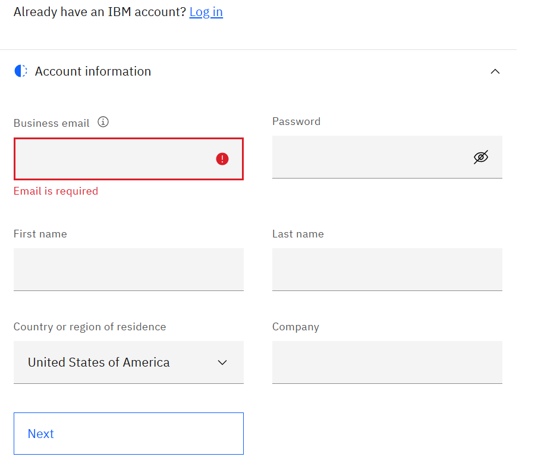

# Lab Access to Linux guests on IBM Techzone (Monday 12:51 PM  cloud environment)

1. The Lab excercises will be performed on Red Hat Linux 9.x guests running on IBM Z system Cloud enviroment hosted from IBM Techzone 

2. To access the IBM Techzone (Cloud enviroment) you will need an IBMid
3. If you have IBMid, proceed to step 4,  otherwise execute the following steps to create the IBMid:

    ### Creating an IBMid
    Visit the [IBM ID registration page](https://www.ibm.com/account/reg/us-en/signup?formid=urx-19776). Fill in your email address, add your first and last name, create a password and specify your country of residence. Click Next.

    

    After clicking Next, a verification code will be sent to your email address. Copy and paste the code from your email into the verification box. Click Next.

    Note: check your spam folder or firewall settings if the verification email is not received within 5 minutes. 

4. Connect to the IBM Techzone (Cloud evironment) using the
   [following link](https://github.com/IBM/itz-support-public/blob/main/IBM-Cloud/IBM-Cloud-Runbooks/aix-linux-access.md) 
 

