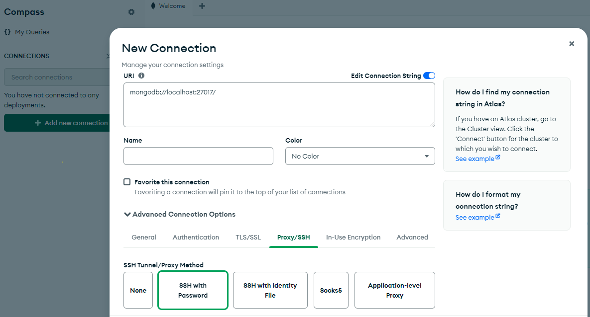
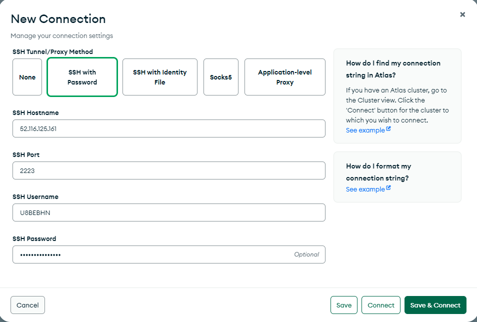
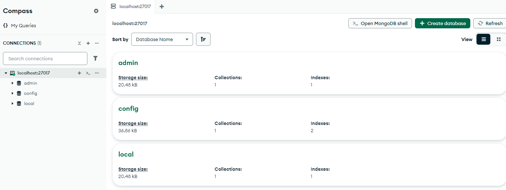
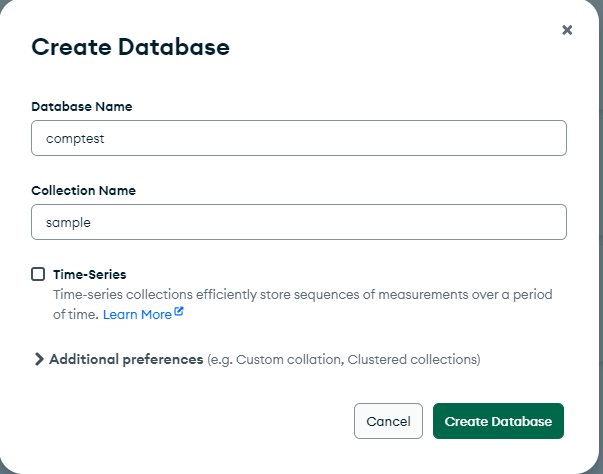
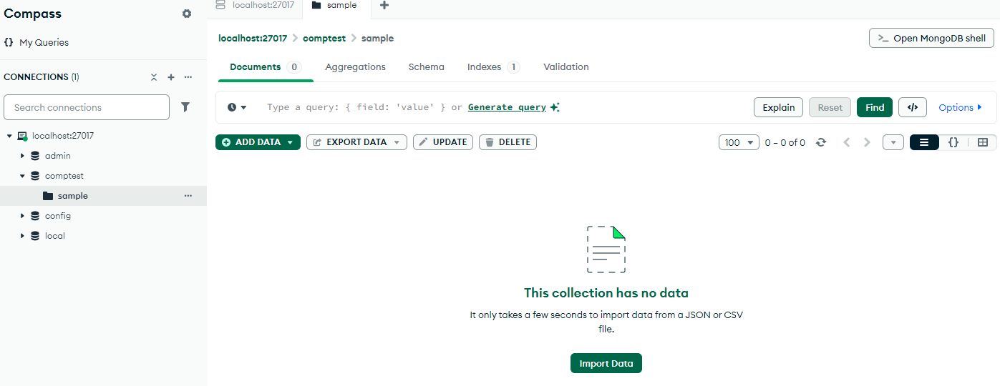
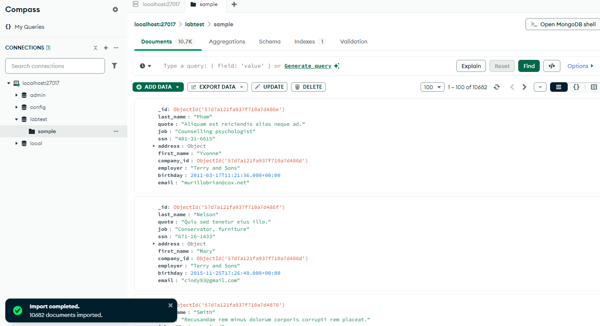

# MongoDB Compass Basics lab

## Overview
 
The objective of this lab is to explore MongoDB running on a Red Hat Enterprise Linux guest on an IBM LinuxONE system using MongoDB GUI tool Compass.

We will be performing some of the following basic operations.

1. Using Compass, make a Connection to your MongoDB deployment  
2.	Create a database and collection
3.	Bulk insert documents

### MongoDB Compass basics lab steps 
#### Using Compass make a connection to your MongoDB deployment  

o	In this step we are going to use MongoDB Compass tool to connect to your MongoDB deployment on the Red Hat Linux Server   
o	If MongoDB Compass is not installed, use the following link 
[MongoDB Compass Download](https://www.mongodb.com/try/download/compass)    
to download and install in your laptop

Using the mouse, click the MongoDB Compass icon on your workstation and select Add new Connection. 

Then expand the Advanced connection options and **select Proxy/SSH tab**

 

Now select **SSH with Password** option    

In the displayed screen, enter the following values:

In the **SSH Hostname** field, enter your **Linux guest ip address** 

In the **SSH Port** field, enter **2223**

In the **SSH Username** field, enter your **Linux guest user name**

In the **SSH Password** field, enter your **Linux guest user Password**

Then press the **Save and Connect** button

And select the localhost:27017 in the left side of navigation
 
The following is an example screen when you are successfully connected to MongoDB Compass

#### Create a new database and a collection in that database 

In this step we are going to create a new database.

Click the  tab 

Specify **comptest** as the database name and collection name as **sample** and then press create database button. 
   

 

Now the **compest** database is created as you can see in the following screen

 
 

#### Import json documents into a collection   

In this step we are going to import documents into the sample collection of the comptest database

We have provided sampData.json file with 10682 documents and should be available in the desktop

Select the **import data** button and choose the **sampData.json** file

This action will import 10682 documents and you can see them in the MongoDB Compass as in the following display

 

You may want to select **TABLE**  view to see the documents in readable format 😊 There will be around 10862 documents there. 

Feel free to move around different screens of MongoDB Compass to perform your favourite operations.
	

## Summary
 
In this lab we connected to MongoDB using Compass GUI tool.

