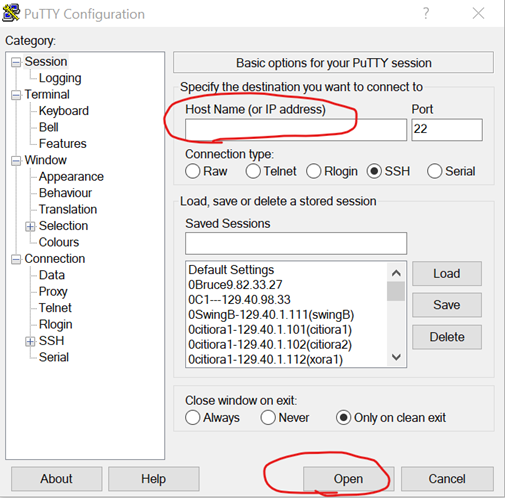
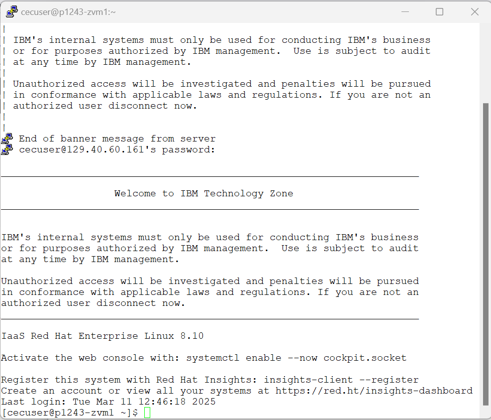

# Lab Access to Linux guests on IBM Techzone (On-premise environment)

1. The Lab excercises will be performed on Red Hat Linux 9.x guests running on IBM Z system in an On-premise enviroment hosted by IBM Techzone 

2. To access the IBM Techzone (On-premise) you need a vpn id and password
3. Connect to the VPN by using Cisco AnyConnect client. 
    If you don't have AnyConnect installed on your system you may follow the steps [outlined here](https://github.com/IBM/itz-support-public/blob/main/IBM-On-premise/IBM-On-premise-Runbooks/configure-vpn.md) 

4. When you established vpn connectivity you can SSH to the Linux guest:

## If you are using windows workstations:
* You can use PuTTY to connect and if PuTTY utility is not available, you can  download and install from the [following url](https://www.putty.org/)
* In the following PuTTY terminal

 

*   Enter your ip address from the user information section in the Host Name field and press Open

* In the displayed terminal enter the login as: **cecuser** and press enter
* For the password prompt enter **mongodblabuser$**

The following is an example of successful login to the Linux Guest

 
